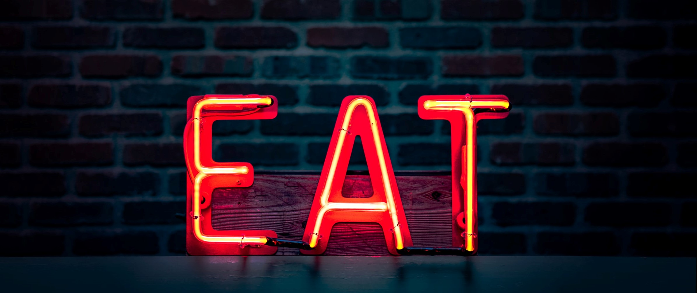

```diff 

+ Under  Construction

```
:two_men_holding_hands:
We are still working on it :shipit:



<h1>Project Goal</h1>

**Contactless Ordering and Payment System.**
In the typical restaurant scenario: After guests are seated, they wait for a server to show up with menus. They may take drink orders, but who knows when they’ll be back to ask about appetizers, or answer questions about the menu. Then there’s that inevitable awkward moment when we stare intently at our server, waiting to catch his eye so we can flag him down for a refill or get us check. We’ve all been there, it’s not fun.

Now imagine this one: Once seated, customers can immediately view the menu via their tableside ordering system. They can place an order as soon as they are ready, and order additional items whenever and as often as they’d like. The servers are available to answer questions and meet the customers’ needs as they dine. After the meal, they can pay and leave, again via their tabletop ordering system. 

So, That;s why we are come with this concepts to tabletop ordering system or payment system.......!!


